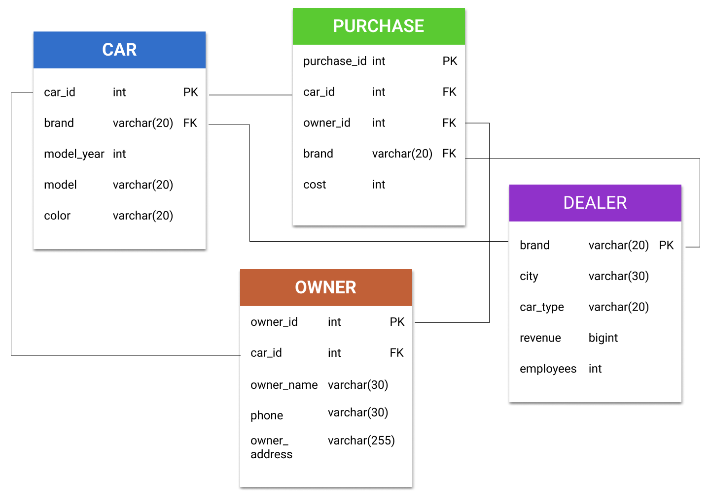
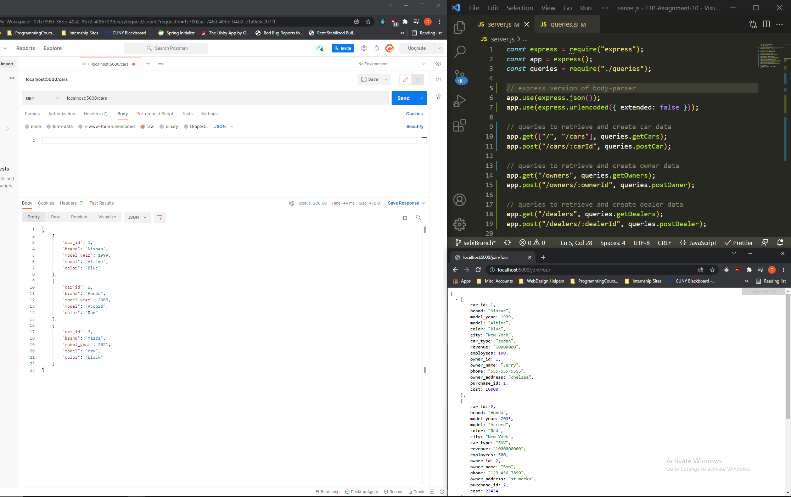
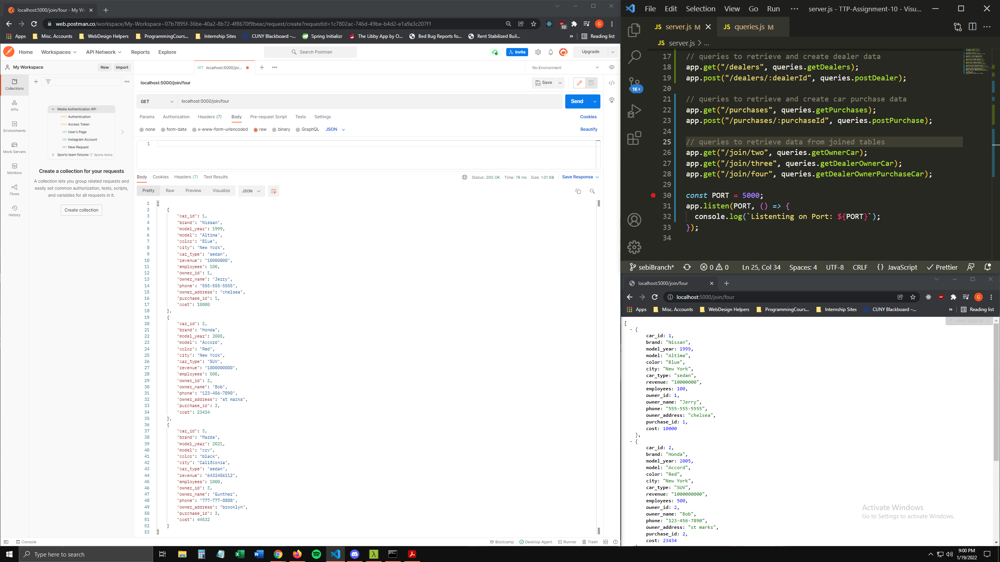
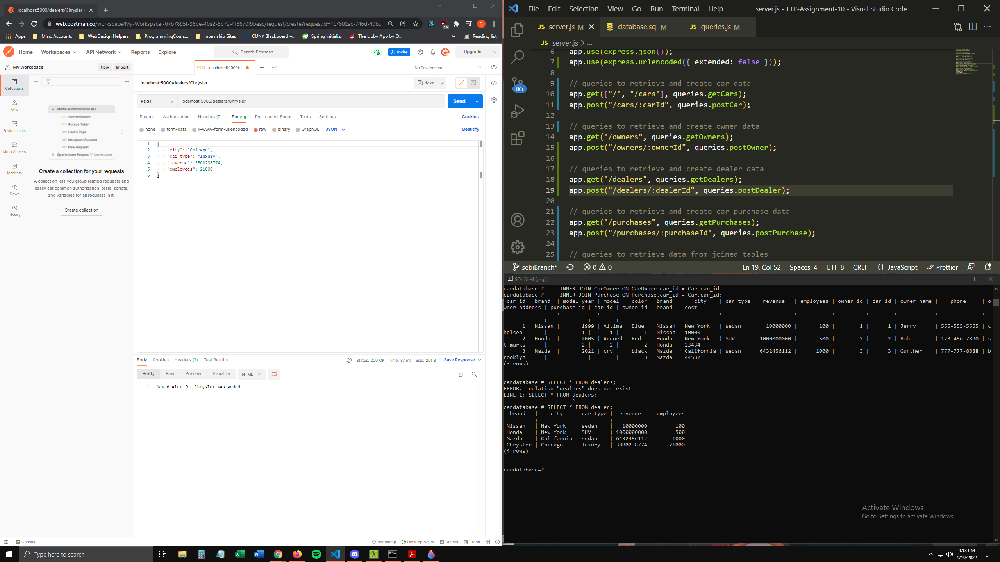

# Assignment 10 - Database Practice

## FIGMA ER TABLE

[Our figma outline](https://www.figma.com/file/LvsbqvPu7lrJOg37iN6aIO/TTP-Assignment-10?node-id=0%3A1)

 

### POSTMAN - Retrieving Data - Cars

 

### POSTMAN - Retrieving Data - Four Table Join (Cars, Owners, Dealers, Purchases)

 

### POSTMAN - Create Data - Dealer

